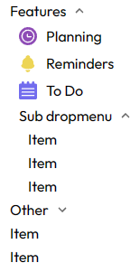
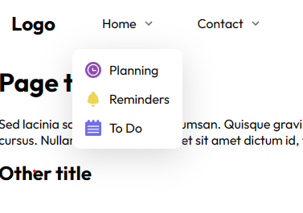
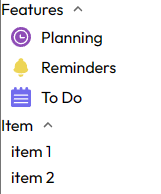

# Dropdown menu

This is a list of dropdown menus.

> If you want to use a link and icon in an element, use ```onClick()``` callback function instead of ```<a href='/'></a>``` because icon will not be clickable.
> Example :
> ```jsx
> // Do like this
><Element onClick={() => navigate('/home')} icon={}>Planning</Element>
>
> // Don't do
><Element icon={}><a href='home'>Planning</a></Element>
> ```
>

## Dropdown menu 1




## Dropdown menu 2 responsive

dropdown menu that didn't have the same behaviour with desktop sreen and mobile screen.

This is an example on desktop :



And on mobile screen :



